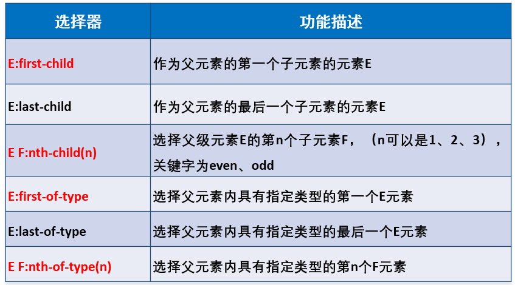

# 1. :full_moon:选择器

[Learning Material: wc3 selector](https://www.w3schools.com/CSSref/css_selectors.php)

用来修饰HTML元素的格式, 但首先你得选择特定的HTML标签来施加修饰, 这就需要选择器. 选择器作为对HTML element施加样式的基础, 如果写错了, 后面不容易debug

:gem: [ chatGPT: css selector e.g.](./chatGPT/cssSelector.md)


:gem: [选择器demo](CSS_Sample/Selector/CSS_Selector.html)   


| selector   | 代码模板           | e.g.                       | description                                                  |
| ---------- | ------------------ | -------------------------- | ------------------------------------------------------------ |
| 通用选择器 | *                  | *{}                        | 选择所有元素                                                 |
| 属性选择器 | [<条件>]           | [href]{}、[attr=”val”]{}   | 根据属性选择元素                                             |
| 并级选择器 | 选择器,选择器      | em,strong{}                | 同时匹配多个选择器，取多个选择器的并集                       |
| 后代选择器 | 选择器 选择器      | .asideNav  li {}           | 先匹配第二个选择器的元素，并且属于第一个选择器内             |
| 子代选择器 | 选择器>选择器      | ul>li{}                    | 匹配匹配第二个选择器，且为第一个选择器的元素的后代           |
| 兄弟选择器 | 选择器+选择器      | p+a{}                      | 匹配紧跟第一个选择器并匹配第二个选择器的元素，如紧跟p元素后的a元素 |
| 伪选择器   | : :伪元素 OR: 伪类 | p::first-line{}、a:hover{} | 伪选择器不是直接对应HTML中定义的元素，而是向选择器增加特殊的效果 |


## 1.1. 基本选择器

+ `标签选择器` 
  固有标签不需要加.前缀

  ```css
  p, div{...}
  ```

+ `类选择器` 
  className前需要.来作为前缀

  + 在同一页面可以多次使用(最常用) 
    + :bangbang: 尽管className大多数情况下用来施加对应的styling, 但className的用处可不仅仅是styling​, 详见:pencil: [className的用途](./sub_topics/className_app.md)
  
  
  ```css
  .imageContainer{...}  /*选中所有class="imageContainer"的元素*/
  ```
  
+ `ID选择器`

  + 同一页面只能使用1次  

  ```css
  #id1{...}     /*选中id="id1"的那一个元素*/
  ```

优先级: ID selector>类selector>标签selector>通配符选择器; 

 + 优先级高的会覆盖优先级低的
+ 关于优先级具体参见[2.3 优先级(权重)](#23-优先级权重)

:gem: [multi-className selector](./CSS_Sample/Selector/06-multiClassNameSelector.html)
:gem: [select all](./CSS_Sample/Selector/08-selectAll.html)


Q&A: ID与name属性的区别

+ ID具有唯一性
+ name属性
  + 可以结合JS中的getElementByName()来查找元素
  + 当HTML的`<input>`的type="radio"时, 多个相同name的`<input>`才能被算为一组实现单选功能
    + class属性也可实现将不同种类的的标签归为一个类别. 不同标签可以使用相同的类名, 主要用于css选择


## 1.2 层次选择器

allow us to reach down to branch of tag tree

### 1.2.1 基本层级选择器

+ 子类(child)选择器
  + `A>B{...}`, 用`>`连接两个元素, 表示选中A的子代B, A与B之间只有`>`没有其他任何符号. 
+ 后代(descendant)选择器
  + `A B{...}`, 用空格连接两个元素, 表示选中A下属所有(后代)B.

### 1.2.2 结构伪类选择器



+ element:nth-child(n): **选中第n个element**(而不是element的第n个child)
  + 需要你首先限定是哪个group的元素 
  + 如果不限定, 那就选择所有组别的nth element


> 注意写选择器时一定要仔细, 一个符号的差异可能带来完全不同的选择结果, 导致debug时很困难

:gem: e.g.1
如下, 选中所有classname为website的ol标签下的所有li下的所有a元素

```css
ol.website li a{
    text-decoration: none;
}
```

:gem: e.g.2

```html
<header>
  <section class="header_left">
    ...
  </section>

  <section class="header_right">
    ...
  </section>
</header>
```

要选中header下面那个classname为header_left的section元素: 

+ 最准确的写法

  ```css
  header>section.header_left{
    ...
  }
  ```

+ 省略写法(确保header下只有一个classname为"header_left"的元素)

  ```css
  header .header_left{
    ...
  }
  ```

+ 错误写法, 啥也选不中

  ```css
  /*选中className为"header_left"的header元素， 可是html中根本没有这个元素*/
  header.header_left{ 
    ...
  }
  ```

:gem: e.g.3  
[wc3 Selector: nth-child demo](https://www.w3schools.com/CSSref/tryit.php?filename=trycss3_nth-child)


## 1.4 属性选择器

select tag element based on class name filter

| selector                 | description                                                  |
| ------------------------ | ------------------------------------------------------------ |
| E[attr]                  | 选择匹配具有属性attr的E元素                                  |
| 直接选择: E[attr=val]    | 选择匹配具有属性attr的E元素,并且属性值为val（其中val区分大小写） |
| 开头选择: E[attr^=val]   | 选择匹配元素E，且E元素定义了属性attr，其属性值是以val开头的任意字符串 |
| 结尾选择: E[attr$=val]   | 选择匹配元素E，且E元素定义了属性attr，其属性值是以val结尾的任意字符串 |
| 相关性选择: E[attr*=val] | 选择匹配元素E，且E元素定义了属性attr，其属性值包含了“val”，换句话说，字符串val与属性值中的任意位置相匹配 |

+ 多个属性选择器可以合并选择
  一般用于text的多重filter, 比如先筛出来href和"google"相关的, 再筛出来href是以".com.au"结尾的

```css
a[href="https://example.org"]
{
  color: green;
}
```

## 1.5 :moon: 伪类(pseudo class)

:book: [MDN: Pseudo-class introduction](https://developer.mozilla.org/en-US/docs/Web/CSS/Pseudo-classes)

以`<a>`为例: `<a>`的Pseudo class代表`<a>`的某种状态, 可以理解为`<a>`的状态选择器(state selector)

| 伪类名称  | 含义                                | 实例                    |
| --------- | ----------------------------------- | ----------------------- |
| a:link    | 未单击hyperlink时的状态             | a:link{color:#9ef5f9;}  |
| a:visited | 单击hyperlink后的状态               | a:visited {color:#333;} |
| a:hover   | 鼠标悬浮在Hyperlink时的状态         | a:hover{color:#ff7300;} |
| a:active  | 鼠标单击hyperlink, 但未释放时的状态 | a:active {color:#999;}  |

+ 类似的, .className:hover{...}代表用标签选择器选中的元素的悬浮伪类

:gem: [`<a>`的伪类选择器1](./CSS_Sample/Selector/17-pseudoClassSelector1.html)

:gem: [`<a>`的伪类选择器2](./CSS_Sample/Selector/17-pseudoClassSelector2.html)

:gem: [`<input>` 的 foucs selector](./CSS_Sample/Selector/18-focusSelector.html)


## 1.6 :bangbang:伪元素 (Pseudo element)

:book: [MDN: Pseudo element introduction](https://developer.mozilla.org/en-US/docs/Web/CSS/Pseudo-elements)

将Pseudo element理解为某个element的附属元素, 僚机, 

Use cases: 

+ :bangbang: 结合selector我们可以对这些Pseudo element做出单独的style的定义. e.g. add a logo at the left of a hyperlink


常用的Pseudo element:

+ `::before`: creates a pseudo-element that is **the first child** of the selected element. 
+ `::after`: creates a pseudo-element that is **the last child** of the selected element
+ `::first-letter`
+ `::first-line`
+ `::selection`:  applies styles to the part of a document that has been highlighted by the user (such as clicking and dragging the mouse across text).


:question: ​pseudo element的定位与布局有些tricky!


如利用pseudo element来加图标: 

+ 先弄一个span, 为其规定好width (这点很重要!)
+ 然后再定义这个span的pseudo element

```react
  return (
    <div className={styles.dropdownSelect} ref={buttonRef} style={style}>
      <span className={styles.dotMarker}></span>
      <button onClick={toggleDropdown} className={styles.titleButton}>
        {/* active state */}
        {state}
        {isOpen && <div className={styles.arrowUp}></div>}
        {!isOpen && <div className={styles.arrowDown}></div>}
      </button>
      {isOpen && (
        <div className={styles.dropdownContent}>
          {stateOptions.map((option, index) => (
            <button
              onClick={(e) => {
                handleClick(option);
              }}
              className={styles.optionButton}
            >
              {option}
              {state === option && <span className={styles.checkMark}></span>}
              {state !== option && <span></span>}
            </button>
          ))}
        </div>
      )}
    </div>
  );
```


```scss
$button-min-width: 120px;
$button-min-height: 24px;

.dropdownSelect {
  position: relative;
  display: inline-block;

  min-width: 150px;

  .dotMarker {
    width: 16px;
    &::before {
      content: "";
      position: absolute;
      left: -10px;
      top: 6px;

      width: 12px;
      height: 12px;
      background-color: #01afc5;
    }
  }

  .titleButton {
    background-color: #ffffff;
    // min-width: $button-min-width;
    min-height: $button-min-height;

    border: none;
    color: #000000;
    font-size: 18px;
    font-weight: 700;

    display: flex;
    flex-direction: row;
    justify-content: space-around;
    align-items: center;

    &:hover {
      cursor: pointer;
    }

    .arrowDown {
      width: 16px;

      &::after {
        content: "";
        position: absolute;
        bottom: 10px;

        // margin-left: 6px;

        width: 12px;
        height: 12px;

        transform: rotate(45deg);
        border-right: 3px solid #f84283;
        border-bottom: 3px solid #f84283;
      }
    }

    .arrowUp {
      width: 16px;

      &::after {
        content: "";
        position: absolute;
        top: 10px;
        // margin-left: 6px;

        width: 12px;
        height: 12px;

        transform: rotate(-135deg);
        border-right: 3px solid #f84283;
        border-bottom: 3px solid #f84283;
      }
    }
  }

  .dropdownContent {
    /* display: none; */
    position: absolute; // position the dropdown
    background-color: #f2fbfc;
    min-width: 100%;
    box-shadow: 0px 8px 16px 0px rgba(0, 0, 0, 0.2);
    z-index: 999;

    border: 1px solid #707070;

    .optionButton {
      position: relative;

      min-width: 100%;
      min-height: $button-min-height;

      font-size: 18px;
      font-size: 700;
      color: #000000;

      background-color: #f2fbfc;
      border: none;
      padding: 4px 4px;
      text-decoration: none;
      display: block;

      position: relative;
      display: flex;
      flex-direction: row;
      justify-content: space-between;
      align-items: center;

      padding: 4px 8px 4px;

      .checkMark {
        width: 18px;

        // Arrow icon styles go here
        &::after {
          content: "";
          position: absolute;
          top: 6px;
          // margin-left: 6px;

          width: 6px;
          height: 12px;

          transform: rotate(45deg);
          border-right: 3px solid #f84283;
          border-bottom: 3px solid #f84283;
        }
      }

      &:hover {
        background-color: #00afc5;
        color: white;
      }

      &:not(:last-child) {
        &::after {
          content: "";
          position: absolute;
          left: 50%;
          bottom: 0;
          width: 90%; // Adjust this to control the width of the bottom line
          height: 2px; // Adjust this to control the thickness of the bottom line
          background-color: #dbdbdb; // Color of the bottom line
          transform: translateX(-50%); // This centers the line at the bottom
        }
      }
    }
  }
}
```

