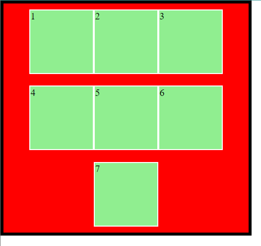

:moon: Block element


# Key takeaways

即div tag

```html
<div class="block1"></div>
```

这部分介绍block element的position, dimension以及layout的控制语句


# box model (盒模型)


先介绍dimension properties of a block


margin相当于邻居间的间隔, border相当于栅栏宽度, padding相当于自家院子里的草坪宽, content相当于自己的房子

:gem: [box model](./CSS_Sample/Block_Dimension/31-boxModel.html)

:gem: [block dimension](./CSS_Sample/Block_Dimension/Block_Dimension.html)


如图, 一个box涉及到的dimension由外而内依次是:

+ top, left...等位移属性, 是相对于位移属性参照物而言, 见[2.2.4 位移属性参照物](#224-star-位移属性参照物)

+ margin (邻居间的间隔), 外边距
  Margin属性，表示该block与其他block之间的最小距离. e.g.如果block1(margin:30px)与block2(margin:50px), 那么他们俩之间实际间距是50px;

  + margin的'重载'

    ```css
    margin: 上下 左右;      /*2个argument*/
    margin: 上 左右 下;     /*3个argument*/
    margin: 上 右 下 左;    /*4个argument*/
    ```

    + 除了使用margin一起定义上下左右, 还可以单独定义某一边的margin (如margin-left...);

  + margin 还可以用来让**box水平居中**(而不是box中的内容水平居中, 见[text居中](#41-full_moon-text)), 满足两个条件:

    + box已经定义了width
    + box左右外边距都为auto

    ```css
    Margin: 0 auto;   /*上下外边距为0, 左右外边距auto*/
    ```

    :gem: [用margin实现box水平居中](./CSS_Sample/Block_Dimension/33-margin%E6%B0%B4%E5%B9%B3%E5%B1%85%E4%B8%AD.html)
    除此之外, 当定义`height`, `line-height`的数值一样时, 也可实现在垂直方向山居中

  + [mozilla: margin collapse](https://developer.mozilla.org/en-US/docs/Web/CSS/CSS_Box_Model/Mastering_margin_collapsing) :question: 没太懂
    :gem: [margin合并塌陷](./CSS_Sample/Block_Dimension/34-margin合并塌陷.html) 

+ border

  + block有圆角

    ```css
    .block1{
        width: 300px;
        height: 300px;
        background: red;
        border: 3px solid black;
        border-radius: 10px;
      }
    ```

  + block变成circle

    ```css
    .block1{
        width: 300px;
        height: 300px;
        background: red;
        border: 3px solid black;
        border-radius: 50%;
      }
    ```

+ padding  (自家院子), 内边距

  + padding的'重载', 和margin类似

+ content (自家房子)


---

## 盒模型注意事项:

+ 网页元素很多都带有默认的内外边距，而且不同浏览器默认的也不一样，因此我们在布局前，要先清除网页元素的默认内外边距.

  ```css
  body,html{
    padding: 0;   /*内边距*/
    margin: 0;    /*外边距*/
  }
  ```

+ 区分几个概念

  + 看到的方块
    即border+padding+content
  + box
    即width, height所定义的区域

+ box

  + 默认box是只包含content. 
    + 此时box不等于看到的方块, 因而此时定义padding, border后会看到方块会变大
  + 定义: `box-sizing: border-box;`后, box延伸到包含border (即此时box = border + padding + content).
    + 此box就是我们看到的方块. 
    + 一般工作中，我们直接全局定义box-sizing, 这样方便一些. 
  + 如下, 定义一个500*500px的block, 当设定其box-sizing: border-box后, 它的border+padding+content=500
    

+ 嵌套的box结构

  + 里面的box占据外面的box的content 
    + 不管有没有定义`box-sizing: border-box;` 里面的box都是用外面的box的**content部分**作为边框进行嵌套 
      :gem: [nested boxes](./CSS_Sample/Block_Dimension/nestedBox.html) 
  + 如果不为box写width, height, 则默认box的宽高就是包络其所有sub-element的最小矩形 
  + 如果对内部的box声明: width:100%, 则内部box将继承外部box的content那部分的width (而不是外部box的全部width).
  + 实际代码中, 多层div的嵌套运用很常用, 不同的层次的div可能有不同的作用 (见JR_Ally_Wk1tut.flexCard)


:gem::question: [padding不影响盒子大小的情况](./CSS_Sample/Block_Dimension/32-padding%E4%B8%8D%E4%BC%9A%E5%BD%B1%E5%93%8D%E7%9B%92%E5%AD%90%E5%A4%A7%E5%B0%8F%E6%83%85%E5%86%B5.html)


# 1. Block element basics

## 1.1 设置html, body margin & padding

如下设置之后, block与网页的间距会消失

```css
html,body{
    margin:0;
    padding:0;
}
```


## 1.2 :bangbang: ​文档流

设置两个block, 会发现block2并不是出现在block1的右边, 而是在它下面

事实上, 一个block element实际上是占一行的文档。Block默认是从左上角开始出现，新的block会占新的一行，而不是出现在旧的block的右边。

inline-element可以在一行内接连出现

:gem: [block element, inline element](./CSS_Sample/Block_Element/Block.html)


总之, 文档流是页面元素的排布顺序(可能是用array的形式存储的?), 从左到右, 从上到下

+ 表示文档流的数据结构可以认为是父元素的一个field
  + 如果一个页面有多个同级别的父元素, 每个父元素下有多个子元素, 则子元素加入对应父元素的文档流
  + 另外记得如果是block element的嵌套, 子元素都是以父元素的content部分作为外边框来排布, 不管有没有定义`box-sizing: border-box;`

:gem::gem: [文档流与位移属性参照物](./CSS_Sample/Block_Position/Block_Position.html)


## 1.3 Display属性

block的display属性, 默认是block, 即服从上面的文档流, 一个block结束了, 下一个block从下一行开始;

如果将display设为inline-block, block对外会呈现出inline的性质, 像text一样从左向右排列, 一行满了再去下一行.

```html
  <div class="block1"></div>
  <div class="block2"></div>
  <div class="block2"></div>
```

```css
html,body{
    margin:0;
    padding:0;
}

.block1{
    width: 300px;
    height: 300px;
    background: red;
    border: 3px solid black;
    border-radius: 10px;
    display:block;
}

.block2{
    width: 300px;
    height: 300px;
    background: yellow;
    border: 3px solid black;
    border-radius: 10px;
    display:inline-block;
}
```


# 2. :star: Position of Block

关于block的position属性, 以及位移属性(left, top, right, bottom)

+ 简言之, static的block的位移属性作废, relative与absolute的block的位移属性才生效.
+ 文档流是一个表示元素排列顺序的数据结构(可能是个array?), 元素们由上到小, 由左到右排列. 不参与文档流的元素不被写入这个数据结构.
+ absolute的block不参与文档流, relative的block参与文档流
+ 位移属性参照物的选取

## 2.1 static (by default)

```css
position: static;
```


- Default value.
- Elements are positioned according to the normal flow of the document.
- The `top`, `right`, `bottom`, `left`, and `z-index` properties have no effect.


+ Position属性如果是Static，则位移属性（left,right,top,bottom）无效，block的位置完全由文档流决定
+ 是的, position为static的元素只能认为没有定位, 其位移属性失效, 但元素本身还是参与文档流的


## 2.2 :star: relative

```css
position: relative;
```

- The element is positioned relative to its normal position in the document flow.
- You can use the `top`, `right`, `bottom`, and `left` properties to move the element from its normal position.
- The space where the element would normally have been is still reserved in the document flow.


此时位移定义可以生效:

+ Left: 使得原来位置在新的位置左侧; right同理
+ Top: 使得原来位置在新的位置上侧; bottom同理

```html
<div class="block1"></div>
<div class="block2"></div>
<div class="block2"></div>
```

```css
html,body{
    margin:0;
    padding:0;
}


.block1{
    position: relative;     /*now left, top works*/
    left: 100px;
    top: 100px;

    width: 300px;
    height: 300px;

    display:block;

    background: red;
    border: 3px solid black;
    border-radius: 10px;
}

.block2{
    width: 300px;
    height: 300px;

    display:inline-block;

    background: yellow;
    border: 3px solid black;
    border-radius: 10px;
}
```


+ 使用位移属性, 有可能将block移出视口
+ 位移属性优先级顺序: 如果同时定义了left, right, top and bottom的情况下, left, top优先, right, bottom作废


## 2.3 absolute

```css
position: absolute;
```

- The element is removed from the normal document flow, and no space is created for the element in the page layout.
- It's <span style="color:yellow">positioned relative to its closest positioned ancestor</span> (an ancestor with a position other than `static`). If there isn't such an ancestor, it's placed relative to the initial containing block (usually the viewport).
- The `top`, `right`, `bottom`, and `left` properties determine the position from the edges of the ancestor.


position为absolute的block将会从文档流中脱离出来. 一般当我们想要将某个block移动到某个想要位置时会用position: absolute;

+ [文档流](#212-full_moon文档流)
+ **脱离文档流**的意思是, 该元素不加入其父元素的表示文档流的数据接结构, 不影响接下来block的布局排序，但其自身还是遵从文档流，跟着上一个在文档流中的element, 如下面e.g.中蓝色的block还是在绿色的block的下一行

> :question:疑问：如果连写俩absolute sub block会怎么样？还是各自一行吗？还是重叠在一起？我倾向于重叠在一起

:gem: [position: absolute](./CSS_Sample/Block_Position/absolute.html)


将sub_block2(绿色)从文档流独立出去, sub_block3(紫色)的位置紧跟上一个在文档流中的元素(sub_block1)


如果将sub_block2(绿色)算入文档流, 则sub_block3(紫色)的位置紧跟上一个在文档流中的元素(sub_block2)


## 2.4 fixed

- The element is removed from the normal document flow, and no space is created for the element in the page layout.
- It's <span style="color:yellow">positioned relative to the viewport</span>, meaning it will stay in the same place even if the page is scrolled.

:gem: [fixed](./CSS_Sample/Block_Position/08-fixed.html)

:gem: [Practice: 固定side window到版心右侧](./CSS_Sample/Block_Position/09-%E5%9B%BA%E5%AE%9A%E5%AE%9A%E4%BD%8D%E6%8A%80%E5%B7%A7-%E5%9B%BA%E5%AE%9A%E5%88%B0%E7%89%88%E5%BF%83%E5%8F%B3%E4%BE%A7.html)


## 2.5 sticky

[w3school: sticky](https://www.w3schools.com/howto/howto_css_sticky_element.asp)

An element with position: sticky; is positioned based on the user's scroll position.

A sticky element toggles between `relative` and `fixed`, depending on the scroll position. It is positioned relative until a given offset position is met in the viewport - then it "sticks" in place (like position:fixed).


- A hybrid of relative and fixed positioning.
- The element is treated as `relative` positioned until it crosses a specified point in the viewport, at which point it is treated as `fixed` positioned.
- This effect is often used with headers or navigation menus to keep them visible at the top of the viewport when scrolling past them.
- The `top`, `right`, `bottom`, and `left` properties determine the threshold at which the switch to fixed positioning occurs.


sticky的特点:

+ 以浏览器的可视窗口为参照移动元素 （fixed特点）
+ 粘性定位占有原先的位置 （relative特点）
+ 除了position: sticky, 还需至少定义一个位移属性(滚动后的位置)才能实现sticky的效果

:gem: [sticky](./CSS_Sample/Block_Position/10-sticky.html)


## 2.6 :bangbang::bangbang: ​位移属性参照物

一个元素有没有定位会影响到它的子元素的位移属性的参照物如何选择

+ position属性为relative/absolute/fixed的元素是有定位的
+ position为其他的元素是无定位的. 

**位移属性参照物的选择:**

+ 对于position:absolute的element, 其不参与任何元素的文档流 
  + 如果**没有为**position:absolute的元素声明位移属性, 则该元素选取由文档流决定的原来位置为位移属性参照物(:question:位移属性如果不设置, 默认为0吗?我觉得是的), 但其本身并不参与文档流. 即它们所说的**默认靠左上不重叠**.
  + 如果为position: absolute的元素声明了位移属性 
    + 如果祖先元素有定位(relative,absolute,fixed), 则选取最近一级的有定位的祖先元素为位移属性参照物. 
    + 如果祖先元素均无定位, 则选root element作为位移属性参照物. 
+ 对于position: relative的element, 它参与其父级元素的文档流
  + 选取由其父级元素的文档流决定的原来位置作为位移属性参照物, 不用管其父级元素是否是有定位的.
+ 对于position: fixed的element, 位移属性参照物为browser的viewport, 和父级元素无关, 也不参与任何文档流

:gem::gem: [文档流与位移参照物](./CSS_Sample/Block_Position/Block_Position.html)


## 2.7 :star: block的覆盖关系: z-index


HTML中后面生成的block会优先显示（压在之前的block上）; 但z-index可以调节同层级的优先覆盖关系， z-index一般取值0-999 


# 3. :star:Flexbox

[mozilla: flex box](https://developer.mozilla.org/en-US/docs/Web/CSS/CSS_Flexible_Box_Layout/Basic_Concepts_of_Flexbox)

[CSS-tricks: A comprehensive guidd to flexbox](https://css-tricks.com/snippets/css/a-guide-to-flexbox/#:~:text=Flexbox%20is%20%28aside%20from%20optional%20wrapping%29%20a%20single-direction,items%20to%20wrap%20as%20needed%20with%20this%20property.)

+ 前面的我们如果写多个block, 它们按文档流依次排列下来

  

+ 使用overflow: hidden 来隐藏掉overflow的block

  

:gem: [Demo: flexbox](./CSS_Sample/Flexbox/flexbox.html)


现在我们来看看如何使得block流动, 呈现一种动态布局

## 3.1 Display: Flex


+ 在parent block中未启用display:flex; sub-blocks按文档流竖着排下来
  

+ 在parent block中启用display:flex; sub-blocks横着挤成一排, 此时sub-block的width,height可能会和定义大小不同.
  

  ```html
    <div class="block1">
        <div class="sub_block1">1</div>
        <div class="sub_block1">2</div>
        <div class="sub_block1">3</div>
        <div class="sub_block1">4</div>
        <div class="sub_block1">5</div>
        <div class="sub_block1">6</div>
        <div class="sub_block1">7</div>
    </div>
  ```

  ```css
  body,html{
      margin: 0;
      padding: 0;
  }
  
  .block1{
      height: 500px;
      width: 500px;
      background-color: red;
      border: 5px black solid; 
      /* box-sizing: border-box; */
      /* overflow:hidden; */
  
      position: relative;
  
      display: flex;         
  
  }
  
  .sub_block1{
      height: 100px;
      width:100px;
      background-color: lightgreen;
      border: 2px white solid;
      /* box-sizing: border-box;  */
  
      position: relative;
  }
  ```


## 3.2 Flex flow


在定义了display: flex 之后, 还必须定义flex flow, 这样才能够使得sub-blocks在视口变化时"流动"起来, 后面的justify, align的效果才能生效.

+ 可变视口
  调节body, html中height与width为相对100vh,100vw; 再将block1的height, width调节成相对值, 这样block1便可继承body,html的dimension. 当改变浏览器视口大小时, block1的大小也会随着改变

  ```css
  body,html{
      margin: 0;
      padding: 0;
      height: 100vh;
      width: 100vw;
  }
  
  .block1{
      height: 50%;
      width: 50%;
      ...
  }
  
  ```


flex flow包含两个子属性: flex-direction, flex-wrap; 分别定义他们两个或者直接定义flex flow都可, 但一般我们都分别定义. 写的时候不用管flex-direction, flex-wrap的先后顺序.

+ `flex-direction`: 流动方向
  定义了flexbox的main-axis, cross-aix runs perpendicular to the main axis; **而main-axis则决定了container内的元素的流向** 后面的一切都和main- & cross axis有关

  + `align-` align elements along the cross-axis
  + `justify-` align elements along the main-axis

  ```css
  flex-direction: row/row-reverse/column/column-reverse
  ```

  + row: main-axis runs from left to right
  + row-reverse: main-axis runs from right to left
  + column: main-axis runs from top to bottom
  + column-reverse: main-axis runs from bottom to top

+ `flex-wrap`

  ```css
  flex-wrap: wrap/wrap-reverse
  ```

  + wrap: 顶天花板开始排
  + wrap-reverse: 顶地板开始排

e.g. sub-block顶天花板开始排, 从右向左排
 


对应code:

```css
body,html{
    margin: 0;
    padding: 0;
    height: 100vh;
    width: 100vw;
}

.block1{
  height: 50%;
  width: 50%;
  ...
  display: flex;    
  flex-direction: row-reverse;  
  flex-wrap: wrap;   
}

```

## 3.3 align-content

[mozilla: align-](https://developer.mozilla.org/en-US/docs/Web/CSS/CSS_Flexible_Box_Layout/Basic_Concepts_of_Flexbox#alignment_justification_and_distribution_of_free_space_between_items)

`align-` align elements along the cross-axis

`justify-` align elements along the main-axis


参见下图(flex flow中的第一个图):

其中sub-block在两行之间是有空隙的, 这是因为align-content默认值为stretch, 会把sub-block在在竖直方向上均匀地排布在parent block中, 例如现在sub-block有两行, 那么每一行地高度都为parent block.height/2

将align-content改为flex-start:

```css
.block1{
    height: 50%;
    width: 50%;
    background-color: red;
    border: 5px black solid; 
    /* box-sizing: border-box; */
    /* overflow:hidden; */

    position: relative;

    display: flex;    
    flex-direction: row-reverse;  
    flex-wrap: wrap;   
    align-content: flex-start;      /*this works*/

}
```

可见此时sub-block行与行之间没有空隙了, sub-block的流动连续了.


## 3.4 flex-grow/flex-shrink

单独定义给某个sub-block：

+ flex-grow: 当sub-block的dimension超过原本定义的dimension后继续拉伸, 该sub-block的拉伸速率为原来的n倍
+ flex-shrink: 与flex-grow类似, 收缩速率为原来n倍数
+ Flex-grow和Flex-shrink可以叠加给同一个sub block

```css
.sub_block1:nth-child(3){
    flex-grow: 3;
}
```

## 3.5 :star:content, item & self

简言之:

+ 前标justify: 表示main-axis方向上布局
+ 前标align: 表示cross-axis方向上布局
+ content优先级高于item (详见2.4.5.3 items)
+ content, items 定义在parent block中, self定义在sub-block中

### Only flex flow

初始情况：只是设置了flex flow的direction和wrap， 不设置任何和content, item, self有关的属性时（当然他们有默认设置）


```css
.block1{
    ...
    position: relative;

    display: flex;    
    flex-direction: row;  
    flex-wrap: wrap;   
}
```

### content

1. Justify-content: center/flex-start/flex-end 

   水平方向上center

   
   

   ```css
   .block1{
       ...
       position: relative;
   
       display: flex;    
       flex-direction: row;  
       flex-wrap: wrap;   
   
       justify-content: center;    /*this works*/
   
   }
   ```

   

   其他justify-content属性选项见上图。

   + 其中flex-start, flex-end, center为一组，决定一行的sub block是居左，居右还是居中
   + Space-between, space-around, space-evenly为一组， 决定一行的sub block的gap分布


2. Align-content: center/flex-start/flex-end
   竖直方向上center

    

   ```css
   .block1{
       ...
       position: relative;
   
       display: flex;    
       flex-direction: row;  
       flex-wrap: wrap;   
   
       align-content: center;
   }
   ```

   

   其他align-content属性选项见上图

   +	Flex-start, flex-end, center为一组，决定sub block整体（竖直方向上没有gap）上在mother block的哪个位置
   +	Stretch, space-between, space-around为一组，这时sub block竖直方向上有gap，区别在于gap的分布. 其中strech为默认设置. 他们的区别在于竖直方向上的gap: stretch是头顶mother block, 脚离mother block; space- between 是头脚顶mother block; space-around则是头脚都不顶mother block


3. Justify-content + Align-content
   水平,竖直方向上都center

    

   ```css
   .block1{
       ...
       position: relative;
   
       display: flex;    
       flex-direction: row;  
       flex-wrap: wrap;   
   
       align-content: center;
       justify-content: center;
   
   }
   ```

### item

疑问：content, item, self各是什么？

比喻：content是整体合力做事儿，item是统一做某个个体的事儿，self是个体做自己的事儿

1. align-items
   如果只设置align-items: center(上图图一); 可见sub block也是在竖直方向上居中，但是相比align-content: center; 这些sub block并不是合成一体居中，竖直方向上还有gap。

   由此可见，**align-content是比align-items更强烈的一个指令（即align-content优先级高于align-items，当然也高于后面的align-self)**, 如果你同时写align-content: center; 和align-items: center;(不管先后顺序) 你会发现结果和只写align-content:center;一致.

   

   ```css
   .block1{
       ...
       position: relative;
   
       display: flex;    
       flex-direction: row;  
       flex-wrap: wrap;   
   
       align-items: center;  /*每行在竖直方向上居中于其所被分配的空间*/
   }
   ```

   
   其他align-items属性选项见上图

   + Flex-start, flex-end, center为一组
   + Stretch, baseline为一组

  2. justify-content + align-items

    同时定义justify-content: center;(每行水平居中) 和 align-items: center; （每行在竖直方向上居中于其所被分配的空间）会发现水平和竖直方向上sub block在mother block 内部也居中了，但是由于是align-items这个相对较弱的竖直居中条件，sub block们在竖直方向上还是有gap
    
    
    
      ```css
      .block1{
        ...
        position: relative;
    
        display: flex;    
        flex-direction: row;  
        flex-wrap: wrap;   
    
        justify-content: center;  /*content水平居中*/
        align-items: center;      /*每行在竖直方向上居中于其所被分配的空间*/
      }
      ```

### self

1. align-self

   + Align-self是单独定义一个sub block的布局，因此必须写在sub-block里，而不是mother block里；前面的flex-flow, flex-direction等等定义的是mother block内的sub block的布局，因此必须写在mother block里。
   + Align-self只能改item, 不能改content，因为content是对整体的布局，是最强的（优先级高于align-self，相关解释见” justify-content + align content” ）。如果mother block的css里写了和content相关的指令，那么align-self就不会生效。

   

   ```css
   .sub_block1:nth-child(3){
       /* flex-grow: 3; */
       align-self: flex-start;
   }
   ```

   
   其他align-self属性选项见上图. 

   + 其中边框为黑色的sub block A是我们想要设置align-self的

## 3.6 :moon: order

甚至可以自定义排列顺序:


默认order 为0。按上图图二中order取值的顺序排列

## 3.7 :gem: ​Flexbox Practice

:gem: [flexbox practice: flexbox frog (24个题)](http://flexboxfroggy.com/) 

24题:


# 4. :moon: grid

:book: [w3school: grid](https://www.w3schools.com/css/css_grid.asp)

:book: [mozilla: grid (更详尽)](https://developer.mozilla.org/en-US/docs/Web/CSS/grid-template-columns)

grid是另一种布局方式, 把container的区域划分为column by column (甚至可以grid by grid), 再定义container内部的元素占几个column(e.g.my monash那个界面就是grid做的). 

使用grid布局的好处是, 可以明确指定元素在页面中(或其父级元素中)的位置, 同时还可以做到随页面大小变化而变化(而不是像position: absolute + left/right/top/bottom, 那样不动了)

## 4.1 display: grid

:gem: [grid cards (Ally wk2 tut)](./CSS_Sample/Grid/gridCard.html)

:gem: [grid demo to play with](./CSS_Sample/Grid/gridDemo.html) 注意里面width: 100%在何处定义的

+ grid-item并不需要再定义dimension相关属性, 因为grid-column已经定义好了dimension相关属性


grid模型中主要涉及到两个要素及两个步骤:

+ container (grid container): 定义container的grid-template
+ container内的items (grid item): 基于grid-container的grid template, 定义其内部的grid item如何span
  + 注意grid item必须是有实体的才能显示grid, 一个空内容的标签不显示


---

step1:  
container划分区域

+ `grid-template-columns`: 定义container要通过何种格式的columns划分成多少columns
  + 注意columns的index starts from 1 
+ `grid-gap`: container的column之间的距离

```css
main{
    display: grid;  
    /*partitioned into 14 rows in total*/
    grid-template-columns: 1fr repeat(12, minmax(auto, 60px)) 1fr;         /*fr for fraction. */
    grid-gap: 40px;
    padding: 60px 0;
}
```

---

step2:  
定义container内的items如何span

+ `grid-column`: 基于container的grid-template-columns, 定义grid items如何span

  + 定义grid items的span范围

    ```css
    grid-column: 1 / 3;   /*grid item starts from column1 till column 3 (column1 to column2 actually). */
    
    grid-column: 1 / span 2; /*grid item starts from 1 and span 2 columns (column 1 to column 2 actually).*/
    ```

  :gem: [MDN: grid demo](./CSS_Sample/Grid/gridDemoMDN.html)

  + 注意grid-column的含义:
    
  + 注意column index标在column的左边
    


+ grid item也可以作为grid container继续往深处嵌套

  ```css
  .cards {
    /* start on column 2, span 12 columns结束 */
      grid-column: 2 / span 12;    
      
      display: grid;
      grid-template-columns: repeat(12, minmax(auto, 60px));      /*定义cards这个container如何被它的columns分割*/  
      grid-gap:40px;
  } 
  ```

---

step3:  
继续定义`.cards`这个grid container的grid items如何span

```css
.card{
    /*每张card span 4 columns*/
    grid-column-end: span 4;

    display: flex;
    flex-direction: column;

    cursor: pointer;
    transition: all 0.3s ease 0s;
}
```

