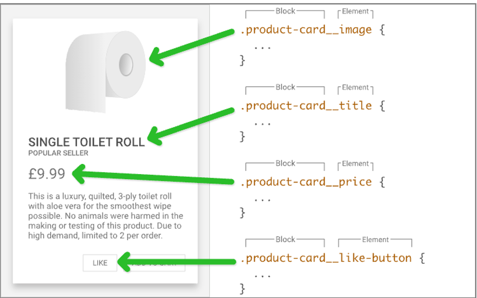

Src:

+ :book: [mozilla CSS](https://developer.mozilla.org/en-US/docs/Web)

# key takeaway

一个选择器内的CSS属性大致分为4类:
+ position(定位)
+ dimension(大小)
+ layout(布局)
+ 其他渲染属性
  + text-
  + font-
  + line-
  + background-
  + ...

因而这里我们也采用这种顺序来组织笔记, chap1-2介绍CSS基本语法思想; chap3介绍block element的position, dimension以及layout的控制语句; chap4介绍其他渲染属性(包括text, background)

# contents

css

| id | Topic | Description |
| ---- | ------------------------- | ---- |
| [1](./C1.md)    | :bangbang: ​css selector  |      |
| [2](./C2.md)    | basic css                 |      |
| [3](./C3.md)    | :bangbang::full_moon: block element & box model | box model  positioning flex box layour grid layout |
| [4](./C4.md)    | :bangbang: ​usual css properties | text  background |
| [5](./C5.md)    | css animation             |      |

scss

:pencil: [my_SCSS_notes](./SCSS/my_SCSS_notes.md)

# 0. BEM命名规范

BEM命名规范用来提高代码可读性, 用来命名class, 分为三部分:
block__element--modifier

用2\*underline和2\*dash来分隔classname

:gem: [BEM命名规范](./CSS_Sample/BEM/03-bem.html)

